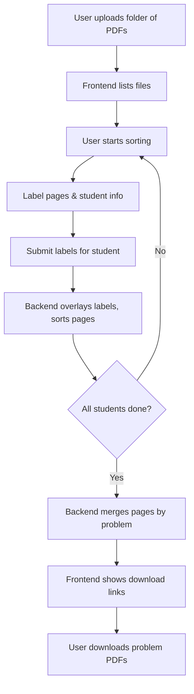

# Exam Grading Website – Project Plan

## 1. Tech Stack

### Frontend
- **Framework:** React (with TypeScript)
- **PDF Handling:** [pdfjs-dist](https://github.com/mozilla/pdfjs-dist) for rendering PDFs in-browser
- **UI Library:** Material-UI (MUI) or similar for fast, accessible UI components
- **State Management:** React Context or Redux (if state gets complex)
- **File Handling:** Browser File API for folder uploads

### Backend
- **Framework:** Node.js with Express (TypeScript)
- **PDF Manipulation:** [pdf-lib](https://pdf-lib.js.org/) or [PDFKit](https://pdfkit.org/) for merging, labeling, and splitting PDFs
- **Storage:** In-memory or temporary disk storage (no user accounts needed)
- **Deployment:** Can be run locally or deployed to a simple server (e.g., Heroku, Vercel, or similar)

---

## 2. User Flow & UI/UX

### Step 1: Upload PDFs
- User lands on the homepage.
- Prompt: “Upload a folder containing one PDF per student.”
- Use the browser’s directory upload feature to allow folder selection.
- Show a list of uploaded files for confirmation.

### Step 2: Start Sorting
- Button: “Start Sorting”
- On click, begin the labeling process for the first student.

### Step 3: Labeling Each Student’s PDF
- Display the first student’s PDF using a PDF viewer.
- UI for labeling:
  - **Student Name:** Input field at the top.
  - **Page Labels:** For each page, a dropdown or quick buttons to assign a problem number.
  - **Navigation:** Next/Previous page, and a summary of labeled pages.
- Button: “Submit & Next Student”
- On submit:
  - Store the labels and student info.
  - Overlay the labels (problem number, name, student id) on each page (visual feedback).
  - Send the labeled data to the backend for processing.

### Step 4: Repeat for All Students
- After submitting, move to the next student’s PDF.
- Continue until all PDFs are labeled.

### Step 5: Download Sorted PDFs
- Once all students are processed:
  - Backend compiles one PDF per problem, each containing all pages labeled for that problem.
  - UI presents download links for each problem’s PDF.

---

## 3. Frontend Components

- **FileUploadPage:** Handles folder upload and file listing.
- **SortingPage:** Manages the labeling process for each student.
  - **PDFViewer:** Renders PDF and overlays labels.
  - **PageLabeler:** UI for assigning problem numbers to pages.
  - **StudentInfoForm:** Input for student name.
- **ProgressBar:** Shows progress through students.
- **DownloadPage:** Lists download links for problem PDFs.

---

## 4. Backend Endpoints

- **/upload** (POST): Accepts all student PDFs (as files or zipped folder).
- **/label** (POST): Receives labeling data for a student (page labels, name, id).
- **/finalize** (POST): Triggers the backend to generate one PDF per problem.
- **/download/:problemId** (GET): Serves the compiled PDF for a given problem.

---

## 5. PDF Processing Logic (Backend)

- For each student:
  - Receive the original PDF and labeling info.
  - Overlay labels (problem number, name, id) on each page.
  - Store each page in a temporary structure, grouped by problem number.
- After all students:
  - For each problem, merge all corresponding pages into a single PDF.
  - Serve these PDFs for download.

---

## 6. Edge Cases & Considerations

- **Large Files:** Use streaming or chunked uploads if needed.
- **PDF Security:** Sanitize PDFs to prevent malicious content.
- **Performance:** For large numbers of students/problems, optimize PDF processing and memory usage.
- **Accessibility:** Ensure UI is keyboard navigable and screen-reader friendly.
- **No Login:** All data is ephemeral; nothing is stored long-term.

---

## 7. Optional Enhancements (Future)

- Drag-and-drop reordering of pages.
- Auto-detect student names from filenames.
- Save progress in browser local storage.
- Allow custom problem numbers or labels.

---

## 8. Summary Diagram

